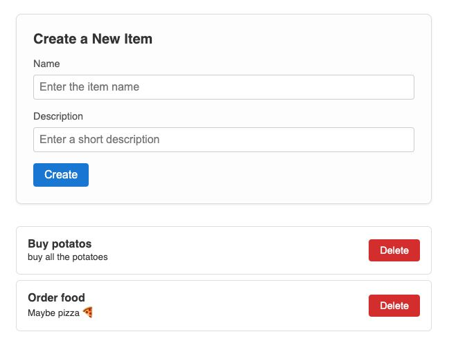

# Coding Session

## Instructions

On the terminal, clone the repo and run the following commands to start the API server:

``` 
cd ./api
npm install
npm start
```

On another terminal tab, run the following command to start the user interface:

```
cd ../ui
npm install
npm run dev
```

Then go the `http://localhost:3000` on your browser



## API Operations Summary

1. GET /api/items
   - Retrieves all items.

2. POST /api/items
   - Adds a new item.
   - Request Body: { "name": "string", "description": "string" }

3. DELETE /api/items/:id
   - Deletes an item by its ID.

Errors:
- 400: Invalid payload or missing ID.
- 404: Item not found.
