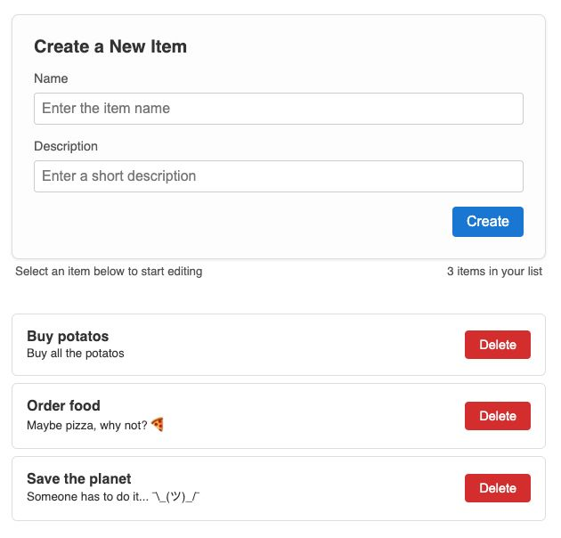

# Coding Session - TODO App

This project is created for educational purposes only. It is not intended to represent production-grade systems, and it may lack optimizations, security considerations, or best practices that are required for real-world applications.

## How to Run It - Instructions

On the terminal, clone the repo and run the following commands to start the API server:

``` 
cd ./api
npm install
npm start
```

The API server should have started on `http://localhost:3333`.

On another terminal tab, run the following commands to start the user interface:

```
cd ./ui
npm install
npm run dev
```

Go to `http://localhost:3000` on your browser and add some list items.

## UI Preview



## API Operations Summary

1. GET /api/items
   - Retrieves all items.

2. POST /api/items
   - Adds a new item.
   - Request Body: { "name": "string", "description": "string" }

3. PUT /api/items/:id
   - Updated an existing item.
   - Request Body: { "name": "string", "description": "string" }

4. DELETE /api/items/:id
   - Deletes an item by its ID.

Errors:
- 400: Invalid payload or missing ID.
- 404: Item not found.
